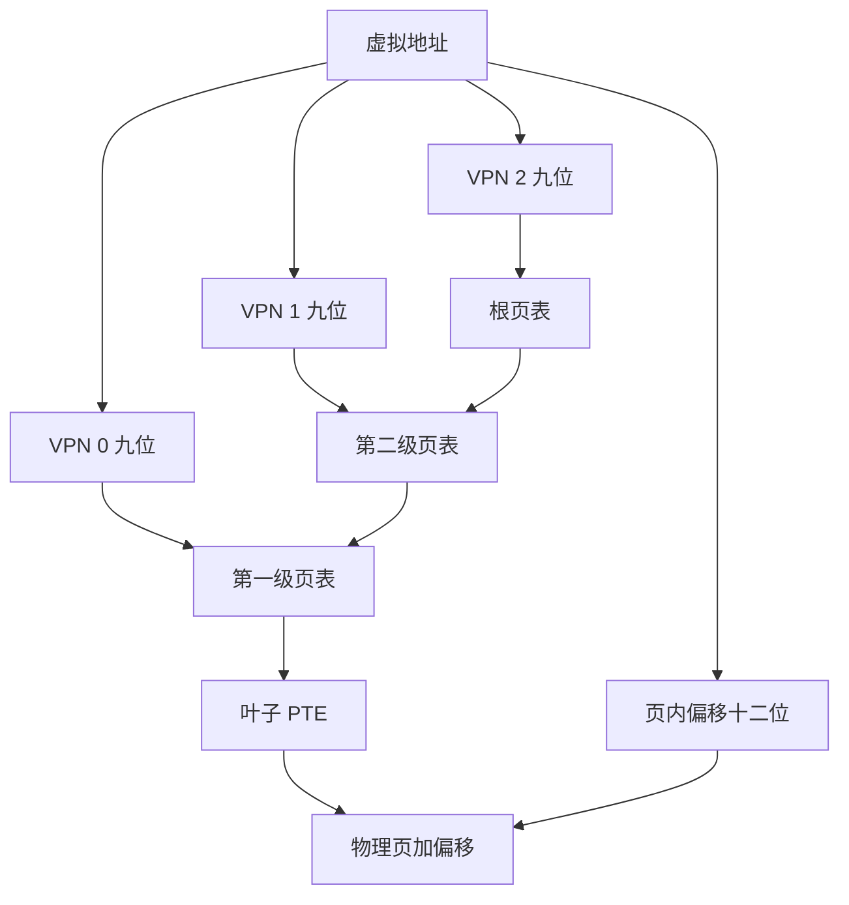
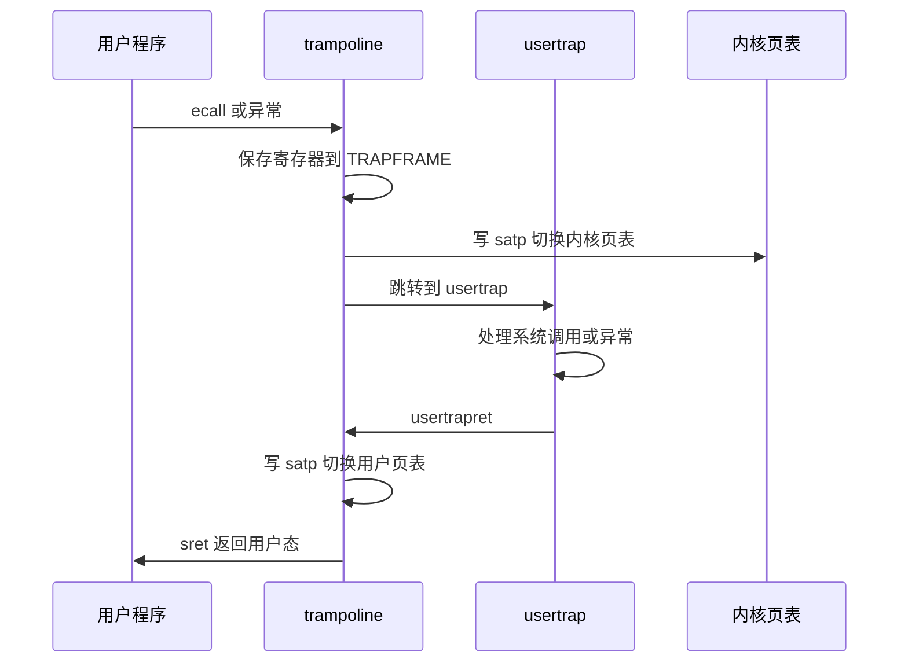
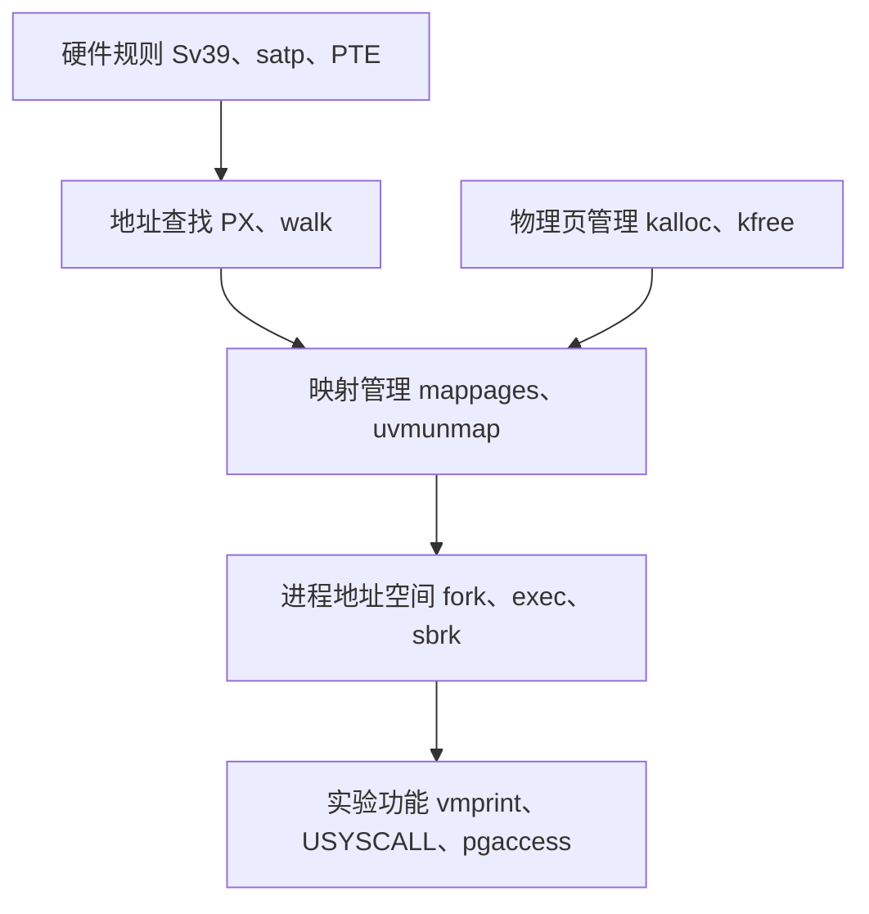

这是实验过程中参考的一些相关资源:

- [课程主页](https://pdos.csail.mit.edu/6.828/2021/schedule.html)
- [课程视频翻译文档](https://mit-public-courses-cn-translatio.gitbook.io/mit6-s081)
- [xv6 book中文翻译](https://th0ar.gitbooks.io/xv6-chinese/content/content/chapter0.html)
- [操作系统导论](https://itanken.github.io/ostep-chinese/)
- [我的代码地址](https://ypj0.xyz/posts/blog-xv6-lab1/git@github.com:ypj0/xv6-labs-2021.git)

## Lab 3：page tables

本实验基于 xv6-riscv 的 `pgtbl` 分支，围绕三个小实验展开：

1. 遍历并打印多级页表；
2. 建立用户只读共享页，让用户态快速读取 PID；
3. 读取 RISC-V 页表中的访问位，报告哪些用户页面被访问过。

---

## 1. 总框架

用户程序使用虚拟地址，物理内存使用物理地址。页表把两者连接起来：

```text
用户虚拟地址
  → 当前进程页表
  → 找到叶子 PTE
  → 得到物理页起始地址
  → 加上页内偏移
  → 得到最终物理地址
```

页表同时提供隔离和权限控制：

- 每个进程可以拥有自己的用户地址空间；
- 两个进程可以使用相同的虚拟地址，但映射到不同的物理页；
- `PTE_U` 决定用户态能否访问；
- `PTE_R`、`PTE_W`、`PTE_X` 决定读、写、执行权限。

页表不是存放普通数据的数组，而是一棵多级树。页表项的位置隐含虚拟页号，页表项内容保存物理页号和权限。

## 1.1 两个必须分清的概念

### 物理页分配

```text
kalloc() / kfree()
```

解决：

```text
哪些物理页空闲，如何分配和回收
```

### 页表映射

```text
walk() / mappages() / uvmunmap()
```

解决：

```text
某个虚拟页应该映射到哪个物理页
```

例如扩大用户堆时，完整流程是：

```text
kalloc() 分配物理页
  → memset() 清零
  → mappages() 建立用户虚拟地址映射
```

只有物理页而没有映射，用户程序找不到它；只有映射而没有有效物理页，访问也会出错。

---

## 2. Sv39：虚拟地址如何拆分

xv6 使用 RISC-V Sv39 页表。页大小是：

```text
PGSIZE = 4096 = 2^12
```

因此虚拟地址低 12 位是页内偏移。剩余的虚拟页号拆成三级索引：

| 字段 | 位范围 | 作用 |
| --- | --- | --- |
| VPN[2] | 30--38 | 根页表索引 |
| VPN[1] | 21--29 | 第二级页表索引 |
| VPN[0] | 12--20 | 第一级页表索引 |
| offset | 0--11 | 页内字节偏移 |

每一级页表有 512 个 PTE：

```text
4096 字节页表页 ÷ 8 字节 PTE = 512 个 PTE
512 = 2^9
```

所以每一级索引正好占 9 位。



## 2.1 具体计算例子

假设虚拟地址是：

```text
VA = 0x0000000123456789
```

页内偏移：

```text
offset = VA & 0xFFF
       = 0x789
```

三级索引：

```text
VPN[0] = (VA >> 12) & 0x1FF = 86
VPN[1] = (VA >> 21) & 0x1FF = 282
VPN[2] = (VA >> 30) & 0x1FF = 4
```

假设根页表地址是 `root`，查找路径是：

```text
root[4]
  → 第二级页表

第二级页表[282]
  → 第一级页表

第一级页表[86]
  → 叶子 PTE
```

假设叶子 PTE 保存的物理页起始地址是：

```text
0x87654000
```

则最终物理地址为：

```text
PA = 0x87654000 + 0x789
   = 0x87654789
```

这里必须记住：

```text
页表项的位置：隐含虚拟页号
页表项内容：物理页号、有效位和权限
原虚拟地址低 12 位：页内偏移
```

PTE 不需要再次保存虚拟页号。

---

## 3. PTE 标志位

xv6 在 `kernel/riscv.h` 中定义：

```c
#define PTE_V (1L << 0)
#define PTE_R (1L << 1)
#define PTE_W (1L << 2)
#define PTE_X (1L << 3)
#define PTE_U (1L << 4)
#define PTE_A (1L << 6)
```

| 标志 | 含义 |
| --- | --- |
| `PTE_V` | 映射有效 |
| `PTE_R` | 允许读取 |
| `PTE_W` | 允许写入 |
| `PTE_X` | 允许执行 |
| `PTE_U` | 用户态允许访问 |
| `PTE_A` | 页面被访问过 |

常见组合：

| 页面 | 权限 |
| --- | --- |
| 用户代码 | `PTE_R \| PTE_X \| PTE_U` |
| 用户数据或堆 | `PTE_R \| PTE_W \| PTE_U` |
| USYSCALL | `PTE_R \| PTE_U` |
| 内核代码 | `PTE_R \| PTE_X` |
| 内核数据 | `PTE_R \| PTE_W` |
| trampoline | `PTE_R \| PTE_X` |

中间页表 PTE 通常只有 `PTE_V`；叶子 PTE 至少有一个 `PTE_R`、`PTE_W` 或 `PTE_X`：

```c
if((pte & (PTE_R | PTE_W | PTE_X)) == 0)
  // 指向下一级页表
else
  // 指向真正的物理页
```

这条判断是 `vmprint()` 和 `freewalk()` 递归处理的基础。

---

## 4. xv6 中到底有几张页表

“每个进程有一张页表”是简化说法。更准确地说：

- 每个进程有一个用户页表根指针 `p->pagetable`；
- 这个根页表通过多级页表页连接到更多页表页；
- 所有 CPU 共享一个 `kernel_pagetable`；
- 用户态运行时使用当前进程的用户页表；
- 进入内核后切换到内核页表。

```text
p->pagetable
  → 根页表
  → 中间页表页
  → 叶子 PTE
  → 当前进程的用户物理页
```

不同进程可以把相同虚拟地址映射到不同物理页：

```text
进程 A 的 VA 0x4000 → 物理页 A
进程 B 的 VA 0x4000 → 物理页 B
```

因此它们互相隔离。

内核页表通常是共享的，但每个进程仍有自己的内核栈。内核栈映射到内核页表，用户页表中没有普通内核栈映射。

---

## 5. 页表根、`satp` 和 `walk()`

`pagetable_t` 定义为：

```c
typedef uint64 *pagetable_t;
```

因此：

```c
p->pagetable
```

就是内核可以直接访问的根页表地址。

`satp` 是 CPU 使用的页表寄存器：

```c
w_satp(MAKE_SATP(kernel_pagetable));
```

`p->pagetable` 和 `satp` 的区别：

| 名称 | 含义 |
| --- | --- |
| `p->pagetable` | 内核中的 C 指针，指向页表根 |
| `satp` | CPU 当前使用的地址转换配置 |

`walk()` 的原型：

```c
pte_t *walk(pagetable_t pagetable, uint64 va, int alloc);
```

参数：

- `pagetable`：要查找的页表根；
- `va`：待查询的虚拟地址；
- `alloc`：中间页表不存在时是否创建。

`walk(pagetable, va, 0)` 的含义是：

```text
只查找，不创建
```

`walk(pagetable, va, 1)` 的含义是：

```text
查找；如果中间页表不存在，就分配并创建
```

`walk()` 返回的是最后一级 PTE 的地址，不是物理地址。要读取 PTE 中保存的物理页，需要：

```c
PTE2PA(*pte)
```

---

## 6. `kvmmake()`、`kvmmap()` 和 `mappages()`

内核启动时，`kvmmake()` 创建内核页表：

```text
kvmmake()
  → kvmmap()
    → mappages()
      → walk(..., 1)
      → 填写叶子 PTE
```

例如：

```c
kvmmap(kpgtbl, UART0, UART0, PGSIZE, PTE_R | PTE_W);
```

表示：

```text
内核虚拟地址 UART0
    → 物理地址 UART0
```

xv6 在这里使用直接映射，很多区域满足：

```text
虚拟地址 = 物理地址
```

但这是 xv6 的布局选择，不是页表机制的要求。

`kvmmap()` 只是对 `mappages()` 的封装。真正写入叶子 PTE 的代码是：

```c
*pte = PA2PTE(pa) | perm | PTE_V;
```

三个函数职责：

```text
walk()
    找到最后一级 PTE，必要时创建中间页表

mappages()
    把物理页号和权限写入最终 PTE

kvmmap()
    调用 mappages()，失败时 panic
```

---

## 7. 物理页分配器和页表的关系

`kernel/kalloc.c` 中的 `kmem.freelist` 管理空闲物理页。每个空闲页的开头暂时作为链表节点：

```c
struct run {
  struct run *next;
};
```

`kalloc()`：

```text
从 freelist 取出一页
  → 返回内核可以访问的地址
```

`kfree()`：

```text
检查页地址
  → 填充垃圾数据
  → 插入 freelist
```

`mappages()` 不分配数据页，只建立映射。因此：

```text
kalloc()：物理页从哪里来
mappages()：虚拟地址如何指向它
```

这是阅读 `uvmalloc()` 时最重要的拆分。

---

## 8. 用户地址空间的生命周期

### 8.1 创建

`uvmcreate()` 分配并清零根页表。随后 `proc_pagetable(p)` 映射：

```text
TRAMPOLINE：跳板代码
TRAPFRAME：当前进程的寄存器保存区
USYSCALL：实验中新增的用户只读共享页
```

### 8.2 增长

`sbrk()` 通过 `growproc()` 调用 `uvmalloc()`：

```text
kalloc() 分配物理页
  → 清零
  → mappages() 建立用户映射
  → 更新 p->sz
```

### 8.3 复制

`fork()` 使用 `uvmcopy()`：

```text
读取父进程 PTE
  → 为子进程分配新物理页
  → 复制页面内容
  → 在子进程页表中建立相同虚拟地址映射
```

xv6 当前实现是复制物理页，不是写时复制。

### 8.4 替换

`exec()` 先构造新页表和新用户映像，成功后才替换：

```text
新 ELF 页表和栈全部准备完成
  → p->pagetable = newpagetable
  → 设置 epc 和 sp
  → 释放 oldpagetable
```

这就是为什么 `exec()` 不会改变 PID 或 `struct proc` 中的进程属性。

### 8.5 释放

`proc_freepagetable()` 必须先解除特殊映射，再调用 `uvmfree()`：

```text
uvmunmap(TRAMPOLINE)
uvmunmap(TRAPFRAME)
uvmunmap(USYSCALL)
uvmfree()
  → uvmunmap 用户叶子映射并释放物理页
  → freewalk() 释放页表页
```

`freewalk()` 要求所有叶子映射已经删除；否则会遇到：

```text
panic: freewalk: leaf
```

本实验中曾遇到这个问题，原因就是新增 `USYSCALL` 后忘记在 `proc_freepagetable()` 中解除它。

---

## 实验一：`vmprint`

## 9. 实验目标

`vmprint()` 要递归打印当前进程的多级页表。每个有效 PTE 输出：

- 当前页表索引；
- PTE 原值；
- `PTE2PA(pte)` 得到的地址。

实现参考 `freewalk()`，但行为不同：

- `freewalk()` 遇到叶子 PTE 会 panic，因为它要求叶子提前删除；
- `vmprint()` 遇到叶子 PTE 要打印并停止递归。

## 9.1 递归逻辑

```c
static void
vmprintwalk(pagetable_t pagetable, int depth)
{
  for(int i = 0; i < 512; i++){
    pte_t pte = pagetable[i];

    if((pte & PTE_V) == 0)
      continue;

    for(int j = 0; j < depth; j++)
      printf(".. ");

    printf("%d: pte %p pa %p\n",
           i, pte, PTE2PA(pte));

    if((pte & (PTE_R | PTE_W | PTE_X)) == 0)
      vmprintwalk((pagetable_t)PTE2PA(pte), depth + 1);
  }
}
```

外层接口：

```c
void
vmprint(pagetable_t pagetable)
{
  printf("page table %p\n", pagetable);
  vmprintwalk(pagetable, 1);
}
```

## 9.2 如何得到根页表

当前进程的根页表：

```c
struct proc *p = myproc();
pagetable_t root = p->pagetable;
```

因此可以：

```c
vmprint(myproc()->pagetable);
```

实验中看到的页表输出通常来自 `exec()` 成功后、用户程序开始运行前打印的当前进程页表。

---

## 实验二：USYSCALL 共享页

## 10. 实验目标

普通 `getpid()` 的调用链是：

```text
用户函数
  → usys.S
  → ecall
  → usertrap()
  → syscall()
  → sys_getpid()
  → 返回
```

本实验把 PID 放到用户可读页面中，让用户态直接读取：

```text
用户程序
  → 读取固定虚拟地址 USYSCALL
  → 得到 PID
```

这减少了一次 trap 和系统调用分派。

## 10.1 地址布局

`memlayout.h` 定义：

```text
USYSCALL
TRAPFRAME
TRAMPOLINE
```

它们位于用户虚拟地址空间顶部：

```text
高地址
┌──────────────────┐
│ TRAMPOLINE       │ 跳板代码
├──────────────────┤
│ TRAPFRAME        │ 当前进程 trapframe
├──────────────────┤
│ USYSCALL         │ 用户只读 PID 页
└──────────────────┘
低地址方向
```

`USYSCALL` 是所有进程都使用的固定用户虚拟地址，但每个进程的页表可以把它映射到不同的物理页。

## 10.2 每进程字段

在 `struct proc` 中增加：

```c
struct usyscall *spid;
```

这里：

- `USYSCALL` 是固定的虚拟地址；
- `p->spid` 是当前进程独有的物理页指针。

创建进程时：

```c
p->pid = allocpid();
p->spid = (struct usyscall *)kalloc();
p->spid->pid = p->pid;
```

映射时：

```c
mappages(pagetable,
         USYSCALL,
         PGSIZE,
         (uint64)p->spid,
         PTE_R | PTE_U);
```

用户态实现：

```c
int
ugetpid(void)
{
  struct usyscall *u = (struct usyscall *)USYSCALL;
  return u->pid;
}
```

## 10.3 生命周期必须完整

新增物理页后，必须同时考虑：

```text
分配：allocproc()
填充：p->spid->pid = p->pid
映射：proc_pagetable()
解除映射：proc_freepagetable()
释放物理页：freeproc()
```

只增加映射而不增加释放逻辑，就会发生：

- `freewalk: leaf`；
- 物理页泄漏；
- 进程槽位重复使用时状态残留。

## 10.4 为什么权限是 `PTE_R | PTE_U`

用户程序只需要读取 PID：

```text
PTE_R：允许读取
PTE_U：允许用户态访问
```

不应该设置：

```text
PTE_W：用户可写
PTE_X：用户可执行
```

因此不能使用 `PTE_R | PTE_X`，也不能遗漏 `PTE_U`。

---

## 实验三：`pgaccess`

## 11. 实验目标

`pgaccess()` 查询：

> 从某个起始虚拟地址开始，连续多少个页面在上次查询之后被访问过？

访问包括：

- 读取；
- 写入；
- 处理器页表遍历成功后产生的访问。

RISC-V 硬件会在叶子 PTE 中设置 `PTE_A`（Accessed）位。系统调用读取这些位，生成位图，然后清除它们。

## 11.1 用户接口

```c
int pgaccess(void *base, int len, void *mask);
```

参数：

| 参数 | 含义 |
| --- | --- |
| `base` | 第一个待检查页面的用户虚拟地址 |
| `len` | 检查的页数 |
| `mask` | 用户空间接收结果位图的地址 |

位图规则：

```text
bit 0 → base 所在页面
bit 1 → base + PGSIZE 所在页面
bit i → base + i * PGSIZE 所在页面
```

实验通常把 `len` 限制为最多 32 页，因为用一个 `uint` 保存结果。

## 11.2 测试如何验证

```c
buf = malloc(32 * PGSIZE);

pgaccess(buf, 32, &abits);

buf[PGSIZE * 1] += 1;
buf[PGSIZE * 2] += 1;
buf[PGSIZE * 30] += 1;

pgaccess(buf, 32, &abits);
```

期望：

```c
abits == ((1U << 1) |
          (1U << 2) |
          (1U << 30))
```

也就是只设置第 1、2、30 位。

第一次调用的重要作用是清掉之前可能已经存在的 `PTE_A`，让第二次查询只反映两次调用之间的访问。

## 11.3 实现步骤

### 第一步：解析参数

```c
uint64 base;
uint64 mask;
int len;

if(argaddr(0, &base) < 0 ||
   argint(1, &len) < 0 ||
   argaddr(2, &mask) < 0)
  return -1;
```

`mask` 变量保存的是用户缓冲区地址，不是结果位图本身。

### 第二步：准备内核位图

```c
uint abits = 0;
```

结果先写入内核变量，最后统一 `copyout()` 到用户空间。

### 第三步：逐页查找 PTE

```c
for(int i = 0; i < len; i++) {
  uint64 va = base + (uint64)i * PGSIZE;
  pte_t *pte = walk(p->pagetable, va, 0);
  ...
}
```

这里必须使用：

```c
walk(p->pagetable, va, 0)
```

而不是 `walkaddr()`。原因是：

- `walkaddr()` 只返回物理页地址；
- `pgaccess` 需要检查并修改 PTE 中的 `PTE_A`；
- `walk()` 返回的是 PTE 指针。

### 第四步：检查并清除访问位

```c
if(pte &&
   (*pte & PTE_V) &&
   (*pte & PTE_U) &&
   (*pte & PTE_A)) {
  abits |= (1U << i);
  *pte &= ~PTE_A;
}
```

这几行分别完成：

```text
PTE 存在
  → 映射有效
  → 是用户页
  → 页面被访问过
  → 设置结果位
  → 清除 PTE_A
```

清除不能写成：

```c
*pte & PTE_A;
```

这只是计算表达式，没有修改任何内容。正确写法是：

```c
*pte &= ~PTE_A;
```

设置位不能写成：

```c
abits | (1U << i);
```

正确写法是：

```c
abits |= (1U << i);
```

### 第五步：复制结果

```c
if(copyout(p->pagetable,
           mask,
           (char *)&abits,
           sizeof(abits)) < 0)
  return -1;

return 0;
```

参数对应关系：

| `copyout` 参数 | 实际含义 |
| --- | --- |
| `p->pagetable` | 当前进程用户页表 |
| `mask` | 用户结果缓冲区地址 |
| `(char *)&abits` | 内核结果位图地址 |
| `sizeof(abits)` | 复制长度 |

`copyout()` 的方向是：

```text
内核位图 → 用户缓冲区
```

## 11.4 我遇到的典型编译问题

### `walk` 隐式声明

报错：

```text
implicit declaration of function ‘walk’
```

原因是 `walk()` 在 `vm.c` 中定义，但没有在 `defs.h` 中声明。系统调用文件通过 `defs.h` 使用它，因此要增加：

```c
pte_t *walk(pagetable_t, uint64, int);
```

如果把 `copyout()` 和 `return 0` 放在页面循环内部，函数只检查第一页就返回，后面的访问位永远不会被扫描。正确顺序是：

```text
扫描全部页面
  → 形成完整位图
  → copyout 一次
  → 返回
```

---

## 12. 页表访问和用户指针的边界

`argaddr()` 只从寄存器中取出用户传来的地址数值，它不会替你完成完整的用户内存访问。

`copyin()`、`copyout()` 会使用进程页表：

```text
用户虚拟地址
  → walkaddr()
  → 物理页
  → 内核复制数据
```

因此不能直接写：

```c
*(struct sysinfo *)addr = info;
```

内核必须通过 `copyout()`。同理，`pgaccess` 最后也必须通过 `copyout()` 把位图传回用户。

---

## 13. Trap、页表切换与特殊页面

RISC-V 发生 trap 时不会自动切换页表或内核栈。xv6 使用 `trampoline.S` 完成这件事：



因此：

- `TRAMPOLINE` 要在用户页表和内核页表中都映射；
- `TRAPFRAME` 保存每个进程的用户寄存器；
- `USYSCALL` 只在用户页表中映射为用户只读页面；
- `KSTACK(p)` 是内核页表中的进程内核栈。

用户地址空间顶部大致是：

```text
高地址
TRAMPOLINE
TRAPFRAME
USYSCALL
...
用户堆
用户栈
代码和数据
低地址
```

内核栈不在这个用户布局中，而是在内核地址空间中，每个进程一页，旁边有 guard page。

---

## 14. 如何根据题目找到应该调用的函数

面对新的页表题目，先把需求分成四个问题：

| 问题 | 对应抽象 |
| --- | --- |
| 需要物理页吗？ | `kalloc()` |
| 需要建立虚拟到物理映射吗？ | `mappages()` |
| 需要查某个地址的 PTE 吗？ | `walk()` |
| 需要访问用户内存吗？ | `copyin()` / `copyout()` |
| 需要创建或释放整个地址空间吗？ | `uvmcreate()` / `uvmfree()` |
| 需要遍历页表吗？ | 参考 `freewalk()` 实现递归 |
| 需要调整进程内存大小吗？ | `uvmalloc()` / `uvmdealloc()` |

再区分函数的职责：

```text
walk：找 PTE
mappages：填 PTE
walkaddr：从用户 VA 找物理页
copyin/copyout：跨用户和内核边界复制
kalloc/kfree：分配和释放物理页
```

这种“先确定数据在哪里，再寻找已有抽象”的方法，比从空白函数开始凭感觉写更可靠。

---

## 16. 复习

### 问题一：虚拟页号存在哪里？

不直接存于 PTE。虚拟页号由页表路径隐含：

```text
根页表索引 + 第二级索引 + 第一级索引
```

PTE 只保存：

```text
物理页号 + 权限位 + 有效位
```

### 问题二：每个进程是不是只有一个页表页？

每个进程有一个用户页表根指针，但根页表会连接多个中间页表页和叶子 PTE。通常所说的“一张页表”指的是一棵多级页表树。

### 问题三：为什么 `pgaccess` 用 `walk` 而不是 `walkaddr`？

因为 `pgaccess` 需要读取和清除 `PTE_A`。`walkaddr` 只返回物理页地址，无法直接修改 PTE 标志位。

### 问题四：为什么 `vmprint` 不能对所有有效 PTE 递归？

有效叶子 PTE 指向用户数据页或代码页；只有没有 `R/W/X` 的有效 PTE 才指向下一级页表。递归叶子会把普通数据当作页表解析。

### 问题五：为什么新增页面时要同时修改创建和释放路径？

物理页有完整生命周期：

```text
kalloc 分配
  → 填充数据
  → 建立映射
  → 使用
  → 解除映射
  → kfree 释放
```

遗漏释放会泄漏；遗漏解除映射会让 `freewalk()` 发现叶子；重复释放会破坏空闲页链表。

### 问题六：为什么 `exec` 要先创建新页表，成功后再替换？

为了保证失败安全：

```text
加载失败 → 释放新页表，旧程序仍可返回
加载成功 → 提交新页表，再释放旧页表
```

### 问题七：`USYSCALL` 为什么每个进程都使用同一个虚拟地址？

虚拟地址可以相同，但每个进程的页表把它映射到不同的物理页。这样用户库只需要把固定地址转换为结构体指针，内核仍能让每个进程看到自己的 PID。

---

## 17. 本章最终框架


